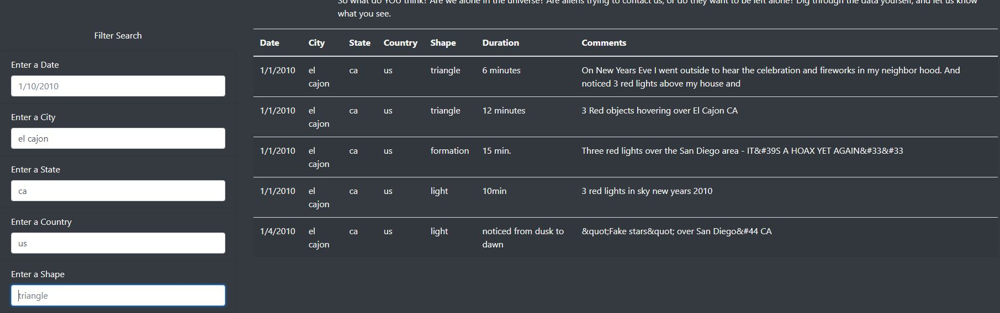
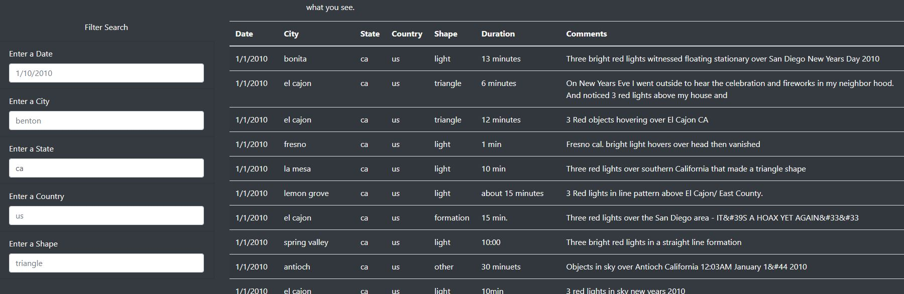

# UFOs

## Overview

### Purpose

The purpose of this project is to provide html-based visualization for UFO data. The project integrates the Bootstrap library for html/css elements along with Javascript for user input/output.

## Results

### Search Guide

Upon reaching the index page, an end user can simply enter criteria into any of the filtering text entry fields and, upon clicking away from the field, the table will automatically filter based on the results.  An example for a search that has been populated with "el cajon" for the city and "ca" for the state is shown below:

If a user desires to clear the fields to get back to the full data set, they need only to delete the filters that have been entered and the page will reload the entire table as is shown below:

## Summary

### Drawbacks

One major drawback to the design is the fact that the current configuration will not work will for large data sets.  The current html layout requires that the entire data set is loaded and displayed, so the index.html page would be quite cumbersome as the data.js file grows in length.

### Recommendations for future design

* To mitigate the situation where index.html becomes cumbersome as the data.js file grows in length, an update to the code to only load and display a limited number of table elements at a time would be beneficial. Users could then use page navigation to cycle through the filtered or non-filtered elements.  However, it would still be beneficial to give the users the option to display as many elements per page as they wish, so that they can make use of powerful hardware if it's available. 
* Allowing the users to enter a range of dates instead of a singular date would be beneficial as they comb through data to perform their analysis. It would make it easier to narrow searches to find repeat events over time in a given location.